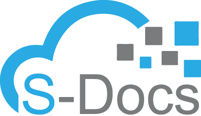

## S-Docs Coding Challenge
Welcome to the S-Docs Coding Challenge! Make sure to have the email sent to you from our Development Team, as it has necessary information that pertains to this coding challenge.

Before you jump into the coding, be sure to run through the steps in the "_getting-started" directory.

This coding challenge is broken up into three stages:
- **Stage 1**: This portion of the coding challenge involves building a basic structure of this coding challenge's final product.
- **Stage 2**: This is the portion of the coding challenge where you will be given tasks to improve the product you have built in Stage 1.
- **Stage 3** (*optional*): This final portion of the coding challenge allows you to add any addition to your final product. Feel free to be creative :)!

## Some Tips
While working on this fun coding challenge, be sure to keep in mind the following tips:
- Test your product as you go along (feel free to log these tests and/or their results)
- Use the Salesforce documentation provided as well as the Salesforce Stack Exchange when you get stuck
- Use a clean coding style
- **Most importantly**: If you have any questions or you are stuck on any item, please feel free to reach out to us! No question is a bad question, we're here to help!

When you have finished the coding challenge, please visit the directory titled "coding-challenge-completed".

Happy coding!