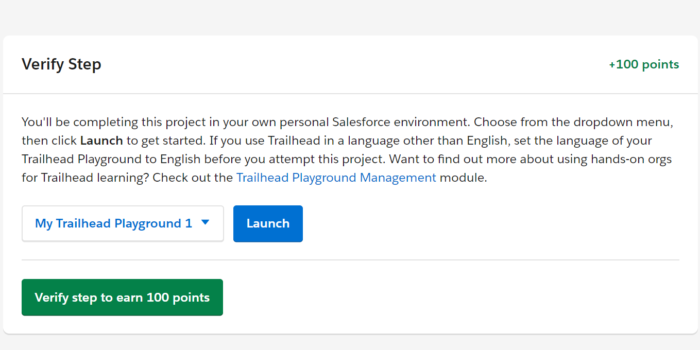

## S-Docs Coding Challenge - Getting Started
Follow these steps below to configure your very own Salesforce Trailhead org for the S-Docs Coding Challenge!

    Note: This section may involve some complicated steps, so please feel free to reach out if you get stuck!

1.) Sign up for a Trailhead account, which can be done [here](https://trailhead.salesforce.com/).

2.) Once logged in and on the home page, type in the search box "Launch Your Trailhead Playground" and hit Enter. From here, you can select any Project which has a subheader of what you typed in, as it will appear with this frame at the bottom of it:

3.) You should have a "My Trailhead Playground 1"; however, it may take a few minutes for this to show. Once this is ready, click Launch.

4.) Once your new Salesforce org has opened in you browser tab, click on the Cog/Gear in the top right corner, then click Developer Console. A new window should pop up.

5.) Create a new Apex Class (File -> New -> Apex Class). Set the name to AccountManagerController.

6.) Copy and paste in the contents of AccountManagerControllerStarterCode.cls attached and then Save.

7.) Create a new VisualForce Page (File -> New -> VisualForce Page). Set the name to AccountManager.

8.) Copy and paste in the contents of AccountManagerPageStarterCode.page attached and then Save.

    Note: You can view the page at anytime using the relative URL path: /apex/AccountManager?id=<<ACCOUNT_ID>>

Congratulations! The Getting Started section is complete, and you are now ready to code. Please visit the directory titled "_stage1" to get started.